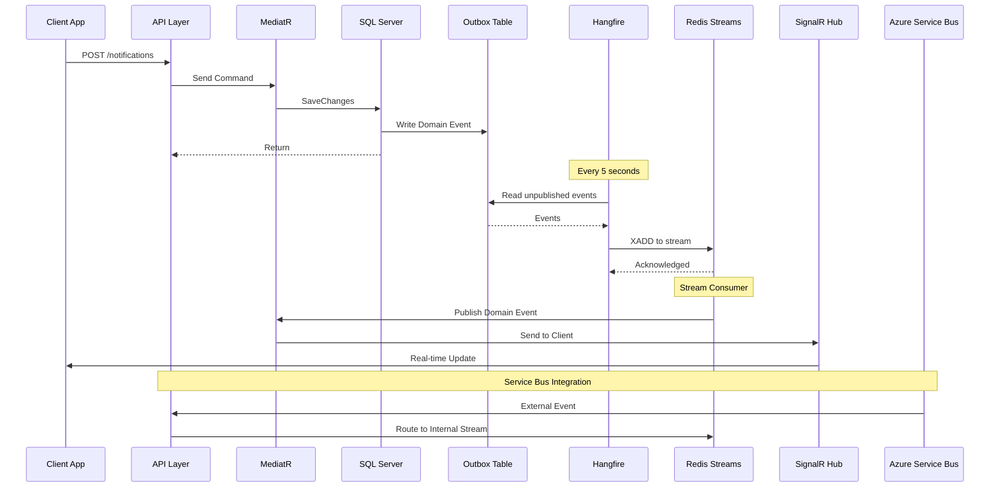
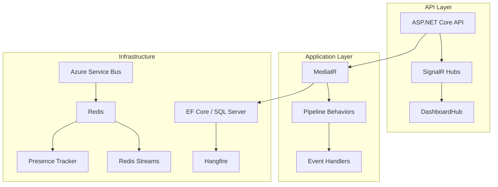

<!-- PROJECT BADGES -->
<p align="center">
  
  
  
  
  
</p>

<h1 align="center">🚀 Notification Engine</h1>

<p align="center">
  A production-ready .NET 8 notification system built with Clean Architecture, featuring real-time SignalR hubs, Redis streams, and Azure Service Bus integration.
</p>

<p align="center">
  <a href="#features">Features</a> •
  <a href="#architecture">Architecture</a> •
  <a href="#getting-started">Getting Started</a> •
  <a href="#api-endpoints">API Endpoints</a> •
  <a href="#configuration">Configuration</a>
</p>

---

## ✨ Features

| Feature | Description |
|---------|-------------|
| 🏗️ **Clean Architecture** | Domain-Driven Design with proper layer separation |
| 📡 **Real-time Notifications** | SignalR hubs with Redis backplane for scaled deployments |
| 🔴 **Redis Streams** | Durable event backbone with consumer groups & exactly-once semantics |
| 🚌 **Azure Service Bus** | Cross-service communication with external event ingestion |
| 📬 **Transactional Outbox** | Reliable event publishing pattern with SQL Server storage |
| ⚡ **Hangfire Jobs** | Background job processing with SQL storage & priority queues |
| 👥 **Presence Tracking** | User online/offline status with Redis sorted sets |
| 📊 **Observability** | OpenTelemetry tracing with Serilog structured logging |
| 🔐 **JWT Authentication** | Secure API access with claim-based authorization |

---

## 🏛️ Architecture

### Solution Structure

```
NotificationEngine/
├── src/
│   ├── NotificationEngine.Domain/          # Core domain layer
│   ├── NotificationEngine.Application/     # Application layer (MediatR)
│   ├── NotificationEngine.Infrastructure/ # Infrastructure layer
│   └── NotificationEngine.Api/             # API layer (ASP.NET Core)
├── tests/                                  # Test projects
├── docker-compose.yml                      # Local infrastructure
└── README.md
```

### Layer Dependencies

```mermaid
graph TD
    API[API Layer<br/>(ASP.NET Core)] --> Application
    API --> Infrastructure
    Application --> Domain
    Infrastructure --> Domain
    Infrastructure --> Application
    
    style API fill:#4ECDC4,stroke:#333,color:#000
    style Application fill:#45B7D1,stroke:#333,color:#000
    style Infrastructure fill:#96CEB4,stroke:#333,color:#000
    style Domain fill:#FFEAA7,stroke:#333,color:#000
```

### Event Flow



### Infrastructure Components



---

## 🚀 Getting Started

### Prerequisites

- [.NET 8 SDK](https://dotnet.microsoft.com/download)
- [Docker Desktop](https://www.docker.com/products/docker-desktop)

### Quick Start

1. **Clone and start infrastructure:**
   ```bash
   docker-compose up -d
   ```

2. **Update connection strings** in `src/NotificationEngine.Api/appsettings.Development.json`:
   ```json
   {
     "ConnectionStrings": {
       "Sql": "Server=localhost;Database=NotificationEngine;User Id=sa;Password=YourStrong@Passw0rd;TrustServerCertificate=true",
       "Redis": "localhost:6379"
     },
     "Authentication": {
       "Authority": "https://your-identity-provider.com",
       "Audience": "notification-engine-api"
     }
   }
   ```

3. **Run the API:**
   ```bash
   cd src/NotificationEngine.Api
   dotnet run
   ```

---

## 📡 API Endpoints

### Health Checks
| Method | Endpoint | Description |
|--------|----------|-------------|
| GET | `/health` | Basic health check |
| GET | `/health/ready` | Readiness check |
| GET | `/health/live` | Liveness check |

### SignalR Hubs
| Hub | Endpoint | Description |
|-----|----------|-------------|
| Dashboard | `/hubs/dashboard` | Real-time notification hub |

### Dashboards
| Endpoint | Description |
|----------|-------------|
| `/hangfire` | Hangfire job dashboard (requires Admin role) |
| `/swagger` | API documentation |

---

## ⚙️ Configuration

### Environment Variables

| Variable | Description | Default |
|----------|-------------|---------|
| `ConnectionStrings:Sql` | SQL Server connection | `localhost` |
| `ConnectionStrings:Redis` | Redis connection | `localhost:6379` |
| `ConnectionStrings:ServiceBus` | Azure Service Bus | - |
| `Authentication:Authority` | JWT issuer | - |
| `Authentication:Audience` | JWT audience | - |

### Queue Priority Order

Hangfire processes jobs in this priority order:
1. `critical` - High priority
2. `default` - Normal priority  
3. `low` - Low priority

---

## 📦 NuGet Packages

| Package | Version | Purpose |
|---------|---------|---------|
| MediatR | 12.2.0 | CQRS & Mediator |
| FluentValidation | 11.9.0 | Request validation |
| EF Core | 8.0.0 | ORM & Outbox pattern |
| Serilog | 10.0.0 | Structured logging |
| SignalR | 8.0.0 | Real-time communication |
| StackExchange.Redis | 2.7.10 | Redis client |
| Hangfire | 1.8.6 | Background jobs |
| OpenTelemetry | 1.7.0 | Observability |

---

## 🔧 Development

### Building

```bash
dotnet build
```

### Running Tests

```bash
dotnet test
```

---

## 📄 License

MIT License - see [LICENSE](LICENSE) for details.

---

<p align="center">
  Built with ❤️ using .NET 8
</p>
