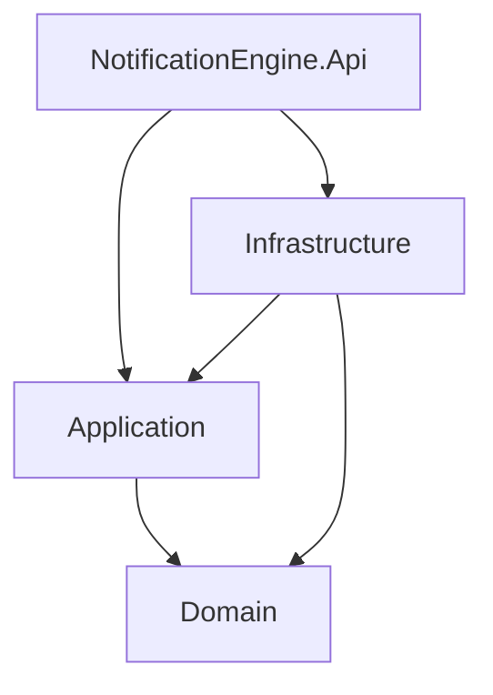

# Implementation Guide - Prompt 1: Project Setup & Core Clean Architecture

## Overview

This document details the implementation of Prompt 1: Project Setup & Core Clean Architecture for the NotificationEngine project.

## Solution Structure

```
NotificationEngine/
├── src/
│   ├── NotificationEngine.Domain/          # Core domain layer
│   ├── NotificationEngine.Application/    # Application layer (MediatR)
│   ├── NotificationEngine.Infrastructure/ # Infrastructure layer
│   └── NotificationEngine.Api/            # API layer (ASP.NET Core)
├── tests/                                  # Test projects (to be added)
├── NotificationEngine.sln                  # Solution file
└── build/                                  # Prompt definitions
```

## Project Dependencies



### Project References
- `Application` references `Domain`
- `Infrastructure` references `Domain` and `Application`
- `Api` references `Application` and `Infrastructure`

## NuGet Packages

### NotificationEngine.Domain
- (None - pure C# class library)

### NotificationEngine.Application
- `MediatR` 12.2.0

### NotificationEngine.Infrastructure
- `Microsoft.Extensions.DependencyInjection.Abstractions` 8.0.0

### NotificationEngine.Api
- `MediatR` 12.2.0
- `Microsoft.AspNetCore.Authentication.JwtBearer` 8.0.0
- `Microsoft.AspNetCore.OpenApi` 8.0.25
- `OpenTelemetry.Extensions.Hosting` 1.7.0
- `OpenTelemetry.Instrumentation.AspNetCore` 1.7.0
- `Serilog.AspNetCore` 10.0.0
- `Swashbuckle.AspNetCore` 6.6.2

## Domain Layer Implementation

### IAggregateRoot.cs

```csharp
namespace NotificationEngine.Domain;

public interface IAggregateRoot
{
    IReadOnlyCollection<IDomainEvent> DomainEvents { get; }
    
    void ClearDomainEvents();
}

public interface IDomainEvent
{
    Guid Id { get; }
    DateTime OccurredOn { get; }
    int Version { get; }
}

public abstract class DomainEventBase : IDomainEvent
{
    public Guid Id { get; } = Guid.NewGuid();
    public DateTime OccurredOn { get; } = DateTime.UtcNow;
    public int Version { get; protected set; } = 1;
}
```

### Entity.cs

```csharp
namespace NotificationEngine.Domain;

public abstract class Entity
{
    private readonly List<IDomainEvent> _domainEvents = new();
    
    public Guid Id { get; protected set; }
    
    public IReadOnlyCollection<IDomainEvent> DomainEvents => _domainEvents.AsReadOnly();

    protected void AddDomainEvent(IDomainEvent domainEvent)
    {
        _domainEvents.Add(domainEvent);
    }

    public void ClearDomainEvents()
    {
        _domainEvents.Clear();
    }
}
```

## Application Layer Implementation

### Abstractions/CQRS.cs

```csharp
namespace NotificationEngine.Application.Abstractions;

public interface ICommand<out TResponse> : MediatR.IRequest<TResponse>
{
}

public interface ICommandHandler<TCommand, TResponse> : MediatR.IRequestHandler<TCommand, TResponse>
    where TCommand : ICommand<TResponse>
{
}

public interface IQuery<out TResponse> : MediatR.IRequest<TResponse>
{
}

public interface IQueryHandler<TQuery, TResponse> : MediatR.IRequestHandler<TQuery, TResponse>
    where TQuery : IQuery<TResponse>
{
}
```

### DependencyInjection.cs

```csharp
using Microsoft.Extensions.DependencyInjection;
using NotificationEngine.Application.Abstractions;

namespace NotificationEngine.Application;

public static class DependencyInjection
{
    public static IServiceCollection AddApplication(this IServiceCollection services)
    {
        services.AddMediatR(cfg =>
        {
            cfg.RegisterServicesFromAssembly(typeof(ICommand<>).Assembly);
        });

        return services;
    }
}
```

## Infrastructure Layer Implementation

### DependencyInjection.cs

```csharp
using Microsoft.Extensions.DependencyInjection;

namespace NotificationEngine.Infrastructure;

public static class DependencyInjection
{
    public static IServiceCollection AddInfrastructure(this IServiceCollection services)
    {
        return services;
    }
}
```

## API Layer Implementation

### Program.cs

```csharp
using System.Diagnostics;
using System.Security.Claims;
using Microsoft.AspNetCore.Authentication.JwtBearer;
using Microsoft.IdentityModel.Tokens;
using NotificationEngine.Application;
using NotificationEngine.Infrastructure;
using OpenTelemetry;
using OpenTelemetry.Trace;
using Serilog;
using Serilog.Events;

var builder = WebApplication.CreateBuilder(args);

Log.Logger = new LoggerConfiguration()
    .MinimumLevel.Information()
    .MinimumLevel.Override("Microsoft", LogEventLevel.Warning)
    .MinimumLevel.Override("System", LogEventLevel.Warning)
    .Enrich.FromLogContext()
    .Enrich.WithProperty("Application", "NotificationEngine.Api")
    .Enrich.WithProperty("MachineName", Environment.MachineName)
    .WriteTo.Console()
    .CreateLogger();

builder.Host.UseSerilog();

builder.Services.AddApplication();
builder.Services.AddInfrastructure();

builder.Services.AddEndpointsApiExplorer();
builder.Services.AddSwaggerGen();

builder.Services.AddAuthentication(JwtBearerDefaults.AuthenticationScheme)
    .AddJwtBearer(options =>
    {
        options.Authority = builder.Configuration["Authentication:Authority"];
        options.Audience = builder.Configuration["Authentication:Audience"];
        options.TokenValidationParameters = new TokenValidationParameters
        {
            ValidateIssuer = true,
            ValidateAudience = true,
            ValidateLifetime = true,
            ValidateIssuerSigningKey = true,
            NameClaimType = ClaimTypes.NameIdentifier,
            RoleClaimType = ClaimTypes.Role
        };
        
        options.Events = new JwtBearerEvents
        {
            OnMessageReceived = context =>
            {
                var accessToken = context.Request.Query["access_token"];
                var path = context.HttpContext.Request.Path;

                if (!string.IsNullOrEmpty(accessToken) && 
                    path.StartsWithSegments("/hubs"))
                {
                    context.Token = accessToken;
                }

                return Task.CompletedTask;
            },
            OnTokenValidated = context =>
            {
                var logger = context.HttpContext.RequestServices
                    .GetRequiredService<ILogger<Program>>();

                if (context.Principal?.FindFirst(ClaimTypes.NameIdentifier) is { } userId)
                {
                    logger.LogInformation(
                        "JWT validated for user: {UserId}",
                        userId);
                }

                return Task.CompletedTask;
            }
        };
    });

builder.Services.AddAuthorization(options =>
{
    options.AddPolicy("UserId", policy =>
        policy.RequireClaim(ClaimTypes.NameIdentifier));
    
    options.AddPolicy("TenantId", policy =>
        policy.RequireClaim("tenant_id"));
    
    options.AddPolicy("UserIdOrSystem", policy =>
        policy.RequireAssertion(context =>
            context.User.HasClaim(c => c.Type == ClaimTypes.NameIdentifier) ||
            context.User.HasClaim(c => c.Type == "system")));
});

builder.Services.AddOpenTelemetry()
    .WithTracing(tracing => tracing
        .AddAspNetCoreInstrumentation()
        .AddSource("NotificationEngine.*"));

builder.Services.AddHttpContextAccessor();

var app = builder.Build();

app.UseSerilogRequestLogging(options =>
{
    options.EnrichDiagnosticContext = (diagnosticContext, httpContext) =>
    {
        var traceId = Activity.Current?.TraceId.ToString() ?? 
                      httpContext.TraceIdentifier;
        var spanId = Activity.Current?.SpanId.ToString();
        
        diagnosticContext.Set("TraceId", traceId);
        diagnosticContext.Set("SpanId", spanId);
        
        if (httpContext.User.FindFirst(ClaimTypes.NameIdentifier) is { } userId)
        {
            diagnosticContext.Set("UserId", userId);
        }
        
        if (httpContext.User.FindFirst("tenant_id") is { } tenantId)
        {
            diagnosticContext.Set("TenantId", tenantId);
        }
    };
});

if (app.Environment.IsDevelopment())
{
    app.UseSwagger();
    app.UseSwaggerUI();
}

app.UseAuthentication();
app.UseAuthorization();

app.MapGet("/health", () => Results.Ok(new { status = "healthy", timestamp = DateTime.UtcNow }))
    .WithTags("Health");

app.MapGet("/health/ready", () => Results.Ok(new { status = "ready", timestamp = DateTime.UtcNow }))
    .WithTags("Health");

app.MapGet("/health/live", () => Results.Ok(new { status = "live", timestamp = DateTime.UtcNow }))
    .WithTags("Health");

try
{
    Log.Information("Starting NotificationEngine API");
    app.Run();
}
catch (Exception ex)
{
    Log.Fatal(ex, "Application terminated unexpectedly");
}
finally
{
    Log.CloseAndFlush();
}
```

### appsettings.json

```json
{
  "Logging": {
    "LogLevel": {
      "Default": "Information",
      "Microsoft.AspNetCore": "Warning",
      "Microsoft.EntityFrameworkCore": "Warning"
    }
  },
  "AllowedHosts": "*",
  "Authentication": {
    "Authority": "https://login.microsoftonline.com/{tenant-id}/v2.0",
    "Audience": "notification-engine-api"
  },
  "Redis": {
    "ConnectionString": "localhost:6379",
    "InstanceName": "notification-engine"
  },
  "OpenTelemetry": {
    "ServiceName": "notification-engine-api",
    "Enabled": true
  }
}
```

## Key Features Implemented

### 1. Clean Architecture Layers
- **Domain Layer**: Contains `IAggregateRoot` interface with domain events collection
- **Application Layer**: Contains MediatR configuration and CQRS abstractions
- **Infrastructure Layer**: Placeholder for future Redis, Service Bus, Hangfire implementations
- **API Layer**: ASP.NET Core 8 with minimal APIs

### 2. MediatR Integration
- MediatR 12.2.0 configured via `AddMediatR()`
- Auto-registration of handlers from Application assembly
- `ICommand<TResponse>` marker interface for distinguishing commands from queries
- `IQuery<TResponse>` marker interface for read operations

### 3. Serilog Structured Logging
- Console output with structured logging
- Context enrichment with:
  - `Application` name
  - `MachineName`
- Request logging via `UseSerilogRequestLogging()`
- TraceId and SpanId propagation from OpenTelemetry

### 4. OpenTelemetry Tracing
- ASP.NET Core instrumentation enabled
- Custom source `NotificationEngine.*` for application spans
- Trace context enrichment in request logging

### 5. JWT Authentication
- JWT Bearer token authentication
- Token passed via query string for SignalR WebSocket upgrade
- Claims mapping:
  - `ClaimTypes.NameIdentifier` → UserId
  - `ClaimTypes.Role` → Roles
  - `tenant_id` → TenantId (custom claim)

### 6. Authorization Policies
- `UserId` - Requires NameIdentifier claim
- `TenantId` - Requires tenant_id claim
- `UserIdOrSystem` - Requires either UserId or system claim

### 7. Health Endpoints
- `/health` - Liveness probe
- `/health/ready` - Readiness probe
- `/health/live` - Live probe with component breakdown

## Build Command

```bash
dotnet build
```

## Notes

- The OpenTelemetry package has a known vulnerability warning (NU1902) - consider updating to a patched version
- Infrastructure layer is minimal - will be expanded in subsequent prompts
- The domain events pattern follows the aggregate root pattern from Domain-Driven Design

---

# Implementation Guide - Prompt 2: Entity Framework Core & The Transactional Outbox Pattern

## Overview

This document details the implementation of Prompt 2 for the NotificationEngine project.

## NuGet Packages Added

### NotificationEngine.Infrastructure
- `Microsoft.EntityFrameworkCore` 8.0.0
- `Microsoft.EntityFrameworkCore.SqlServer` 8.0.0
- `MediatR` 12.2.0
- `System.Text.Json` 8.0.0

## Implementation Details

### 1. OutboxMessage Entity

Location: `src/NotificationEngine.Infrastructure/Persistence/Entities/OutboxMessage.cs`

```csharp
using System.ComponentModel.DataAnnotations;
using System.ComponentModel.DataAnnotations.Schema;

namespace NotificationEngine.Infrastructure.Persistence.Entities;

[Table("OutboxMessages")]
public class OutboxMessage
{
    [Key]
    public Guid Id { get; set; } = Guid.NewGuid();

    [Required]
    public DateTime OccurredOn { get; set; } = DateTime.UtcNow;

    [Required]
    [MaxLength(256)]
    public string Type { get; set; } = string.Empty;

    [Required]
    public string Payload { get; set; } = string.Empty;

    public DateTime? ProcessedAt { get; set; }

    [MaxLength(1000)]
    public string? Error { get; set; }

    [Required]
    [MaxLength(128)]
    public string IdempotencyKey { get; set; } = string.Empty;
}
```

### 2. ApplicationDbContext

Location: `src/NotificationEngine.Infrastructure/Persistence/ApplicationDbContext.cs`

```csharp
using System.Text.Json;
using Microsoft.EntityFrameworkCore;
using NotificationEngine.Domain;
using NotificationEngine.Infrastructure.Persistence.Entities;

namespace NotificationEngine.Infrastructure.Persistence;

public class ApplicationDbContext : DbContext
{
    public ApplicationDbContext(
        DbContextOptions<ApplicationDbContext> options)
        : base(options)
    {
    }

    public DbSet<OutboxMessage> OutboxMessages => Set<OutboxMessage>();

    private static readonly JsonSerializerOptions JsonSerializerOptions = new()
    {
        PropertyNamingPolicy = JsonNamingPolicy.CamelCase,
        WriteIndented = false
    };

    public override async Task<int> SaveChangesAsync(
        CancellationToken cancellationToken = default)
    {
        // Step 1: Collect domain events from IAggregateRoot entities
        var domainEntities = ChangeTracker.Entries<IAggregateRoot>()
            .Where(e => e.Entity.DomainEvents.Count > 0)
            .ToList();

        var domainEvents = domainEntities
            .SelectMany(e => e.Entity.DomainEvents)
            .ToList();

        // Step 2: Clear events from entities (they're now captured)
        foreach (var entity in domainEntities)
        {
            entity.Entity.ClearDomainEvents();
        }

        // Step 3: Save business data to database
        var result = await base.SaveChangesAsync(cancellationToken);

        // Step 4: Write domain events to outbox in SAME transaction
        foreach (var domainEvent in domainEvents)
        {
            var outboxMessage = new OutboxMessage
            {
                Id = domainEvent.Id,
                OccurredOn = domainEvent.OccurredOn,
                Type = domainEvent.GetType().FullName ?? domainEvent.GetType().Name,
                Payload = JsonSerializer.Serialize(domainEvent, domainEvent.GetType(), JsonSerializerOptions),
                IdempotencyKey = $"{(domainEvent.GetType().Name)}_{domainEvent.Id}"
            };

            OutboxMessages.Add(outboxMessage);
        }

        // Step 5: Save outbox messages to database
        if (domainEvents.Count > 0)
        {
            await base.SaveChangesAsync(cancellationToken);
        }

        return result;
    }

    protected override void OnModelCreating(ModelBuilder modelBuilder)
    {
        modelBuilder.Entity<OutboxMessage>(entity =>
        {
            entity.HasIndex(e => e.ProcessedAt);
            entity.HasIndex(e => e.IdempotencyKey).IsUnique();
        });

        base.OnModelCreating(modelBuilder);
    }
}
```

### 3. Design-Time Factory for Migrations

Location: `src/NotificationEngine.Infrastructure/Persistence/ApplicationDbContextFactory.cs`

```csharp
using Microsoft.EntityFrameworkCore;
using Microsoft.EntityFrameworkCore.Design;
using NotificationEngine.Infrastructure.Persistence;

namespace NotificationEngine.Infrastructure.Persistence;

public class ApplicationDbContextFactory : IDesignTimeDbContextFactory<ApplicationDbContext>
{
    public ApplicationDbContext CreateDbContext(string[] args)
    {
        var optionsBuilder = new DbContextOptionsBuilder<ApplicationDbContext>();
        var connectionString = args.Length > 0 
            ? args[0] 
            : "Server=localhost;Database=NotificationEngine;User=sa;Password=YourPassword;TrustServerCertificate=True";

        optionsBuilder.UseSqlServer(connectionString);

        return new ApplicationDbContext(optionsBuilder.Options);
    }
}
```

### 4. Dependency Injection Registration

Location: `src/NotificationEngine.Infrastructure/DependencyInjection.cs`

```csharp
using Microsoft.EntityFrameworkCore;
using Microsoft.Extensions.Configuration;
using Microsoft.Extensions.DependencyInjection;
using NotificationEngine.Infrastructure.Persistence;

namespace NotificationEngine.Infrastructure;

public static class DependencyInjection
{
    public static IServiceCollection AddInfrastructure(this IServiceCollection services, IConfiguration configuration)
    {
        services.AddDbContext<ApplicationDbContext>(options =>
        {
            var connectionString = configuration.GetConnectionString("Sql");
            options.UseSqlServer(connectionString, sqlOptions =>
            {
                sqlOptions.EnableRetryOnFailure(
                    maxRetryCount: 3,
                    maxRetryDelay: TimeSpan.FromSeconds(10),
                    errorNumbersToAdd: null);
                sqlOptions.CommandTimeout(30);
            });
        });

        return services;
    }
}
```

### 5. Updated Program.cs

Location: `src/NotificationEngine.Api/Program.cs`

```csharp
builder.Services.AddApplication();
builder.Services.AddInfrastructure(builder.Configuration);
```

### 6. Updated appsettings.json

Location: `src/NotificationEngine.Api/appsettings.json`

```json
{
  "ConnectionStrings": {
    "Sql": "Server=localhost;Database=NotificationEngine;User=sa;Password=YourPassword;TrustServerCertificate=True"
  }
}
```

## Key Features Implemented

### 1. Transactional Outbox Pattern
- Domain events are intercepted from `IAggregateRoot` entities during `SaveChangesAsync`
- Events are serialized to JSON and written to `OutboxMessages` table in the **same transaction** as business data
- This ensures **at-least-once** delivery: if the transaction commits, the event is persisted

### 2. Idempotency
- Unique `IdempotencyKey` (format: `{EventType}_{EventId}`) prevents duplicate processing
- Unique index on `IdempotencyKey` in database

### 3. Entity Configuration
- `ProcessedAt` - nullable DateTime, set when message is processed
- `Error` - stores error message if processing fails
- Index on `ProcessedAt` for efficient querying of unprocessed messages

### 4. SQL Server Resilience
- Configured with retry-on-failure (3 retries, 10 second max delay)
- 30 second command timeout

### 5. Application Layer Isolation
- The Application layer is completely unaware of the outbox implementation
- Domain events are raised via `IAggregateRoot.DomainEvents` collection
- The Infrastructure layer handles serialization transparently

## Database Schema

```sql
CREATE TABLE OutboxMessages (
    Id              UNIQUEIDENTIFIER NOT NULL DEFAULT NEWSEQUENTIALID() PRIMARY KEY,
    OccurredOn      DATETIME2        NOT NULL,
    Type            NVARCHAR(256)    NOT NULL,
    Payload         NVARCHAR(MAX)    NOT NULL,
    ProcessedAt     DATETIME2        NULL,
    Error           NVARCHAR(1000)   NULL,
    IdempotencyKey  NVARCHAR(128)    NOT NULL,
    CONSTRAINT IX_OutboxMessages_IdempotencyKey UNIQUE (IdempotencyKey)
);

CREATE INDEX IX_OutboxMessages_ProcessedAt 
    ON OutboxMessages (ProcessedAt) 
    INCLUDE (Id);
```

## Build Command

```bash
dotnet build
```

## Migration Command

```bash
dotnet ef migrations add InitialCreate --project src/NotificationEngine.Infrastructure
dotnet ef database update --project src/NotificationEngine.Infrastructure
```

## Notes

- The outbox pattern ensures reliability: if the app crashes after business data is saved but before outbox messages are saved, the data is rolled back
- A Hangfire recurring job (to be implemented in Prompt 6) will read unpublished outbox messages and publish them to Redis Streams
- The Application layer remains clean - no knowledge of outbox persistence

---

# Implementation Guide - Prompt 3: MediatR Pipeline Behaviors

## Overview

This document details the implementation of Prompt 3 for the NotificationEngine project.

## NuGet Packages Added

### NotificationEngine.Application
- `FluentValidation` 11.9.0
- `FluentValidation.DependencyInjectionExtensions` 11.9.0
- `Microsoft.EntityFrameworkCore` 8.0.0 (for TransactionBehavior)

## Implementation Details

### 1. Pipeline Behavior Order

MediatR executes behaviors in reverse order of registration (first registered = outermost). The order is:

1. **LoggingBehavior** - Entry/exit logging with timing
2. **ValidationBehavior** - FluentValidation
3. **PerformanceBehavior** - Warn if handler > 500ms
4. **TransactionBehavior** - Wrap commands in DB transaction

### 2. LoggingBehavior.cs

Location: `src/NotificationEngine.Application/Behaviors/LoggingBehavior.cs`

```csharp
public class LoggingBehavior<TRequest, TResponse> : IPipelineBehavior<TRequest, TResponse>
    where TRequest : notnull
{
    public async Task<TResponse> Handle(
        TRequest request,
        RequestHandlerDelegate<TResponse> next,
        CancellationToken cancellationToken)
    {
        var requestName = typeof(TRequest).Name;

        _logger.LogInformation(
            "[START] Handling {RequestName}",
            requestName);

        var stopwatch = Stopwatch.StartNew();

        try
        {
            var response = await next();
            stopwatch.Stop();

            _logger.LogInformation(
                "[END] Handled {RequestName} in {ElapsedMs}ms",
                requestName,
                stopwatch.ElapsedMilliseconds);

            return response;
        }
        catch (Exception ex)
        {
            stopwatch.Stop();
            _logger.LogError(
                ex,
                "[ERROR] {RequestName} failed after {ElapsedMs}ms: {Error}",
                requestName,
                stopwatch.ElapsedMilliseconds,
                ex.Message);
            throw;
        }
    }
}
```

### 3. ValidationBehavior.cs

Location: `src/NotificationEngine.Application/Behaviors/ValidationBehavior.cs`

```csharp
public class ValidationBehavior<TRequest, TResponse> : IPipelineBehavior<TRequest, TResponse>
    where TRequest : notnull
{
    public async Task<TResponse> Handle(
        TRequest request,
        RequestHandlerDelegate<TResponse> next,
        CancellationToken cancellationToken)
    {
        if (!_validators.Any())
        {
            return await next();
        }

        var context = new ValidationContext<TRequest>(request);

        var validationResults = await Task.WhenAll(
            _validators.Select(v => v.ValidateAsync(context, cancellationToken)));

        var failures = validationResults
            .SelectMany(r => r.Errors)
            .Where(f => f != null)
            .ToList();

        if (failures.Count > 0)
        {
            throw new ValidationException(failures);
        }

        return await next();
    }
}
```

### 4. TransactionBehavior.cs

Location: `src/NotificationEngine.Application/Behaviors/TransactionBehavior.cs`

```csharp
public class TransactionBehavior<TRequest, TResponse> : IPipelineBehavior<TRequest, TResponse>
    where TRequest : notnull
{
    public async Task<TResponse> Handle(
        TRequest request,
        RequestHandlerDelegate<TResponse> next,
        CancellationToken cancellationToken)
    {
        // Only apply transaction to commands (state-mutating operations)
        if (!typeof(ICommand<TResponse>).IsAssignableFrom(typeof(TRequest)))
        {
            return await next();
        }

        var requestName = typeof(TRequest).Name;

        if (_dbContext.Database.CurrentTransaction != null)
        {
            return await next();
        }

        await using var transaction = await _dbContext.Database.BeginTransactionAsync(
            cancellationToken: cancellationToken);

        try
        {
            var response = await next();
            await transaction.CommitAsync(cancellationToken);
            return response;
        }
        catch (Exception ex)
        {
            await transaction.RollbackAsync(cancellationToken);
            throw;
        }
    }
}
```

**Key Feature**: Uses `ICommand<TResponse>` marker to distinguish commands (state-mutating) from queries (read-only). Queries skip the transaction wrapper.

### 5. PerformanceBehavior.cs

Location: `src/NotificationEngine.Application/Behaviors/PerformanceBehavior.cs`

```csharp
public class PerformanceBehavior<TRequest, TResponse> : IPipelineBehavior<TRequest, TResponse>
    where TRequest : notnull
{
    private const long ThresholdMs = 500;

    public async Task<TResponse> Handle(
        TRequest request,
        RequestHandlerDelegate<TResponse> next,
        CancellationToken cancellationToken)
    {
        var stopwatch = Stopwatch.StartNew();
        var response = await next();
        stopwatch.Stop();

        if (stopwatch.ElapsedMilliseconds > ThresholdMs)
        {
            _logger.LogWarning(
                "[PERFORMANCE] {RequestName} took {ElapsedMs}ms (threshold: {ThresholdMs}ms)",
                typeof(TRequest).Name,
                stopwatch.ElapsedMilliseconds,
                ThresholdMs);
        }

        return response;
    }
}
```

### 6. DependencyInjection.cs Updated

Location: `src/NotificationEngine.Application/DependencyInjection.cs`

```csharp
public static IServiceCollection AddApplication(this IServiceCollection services)
{
    services.AddMediatR(cfg =>
    {
        cfg.RegisterServicesFromAssembly(typeof(ICommand<>).Assembly);
        
        cfg.AddBehavior(typeof(IPipelineBehavior<,>), typeof(LoggingBehavior<,>));
        cfg.AddBehavior(typeof(IPipelineBehavior<,>), typeof(ValidationBehavior<,>));
        cfg.AddBehavior(typeof(IPipelineBehavior<,>), typeof(PerformanceBehavior<,>));
        cfg.AddBehavior(typeof(IPipelineBehavior<,>), typeof(TransactionBehavior<,>));
    });

    services.AddValidatorsFromAssembly(typeof(ICommand<>).Assembly, includeInternalTypes: true);

    return services;
}
```

## Key Features Implemented

### 1. Command vs Query Separation
- `ICommand<TResponse>` marker interface identifies state-mutating operations
- `TransactionBehavior` only wraps commands in database transactions
- Queries (implementing `IQuery<T>`) bypass transaction overhead

### 2. FluentValidation Integration
- Validators auto-discovered from Application assembly
- `ValidationBehavior` runs before the handler
- Throws `ValidationException` if any validations fail

### 3. Structured Logging
- All behaviors use Serilog with structured logging
- Request names included in all log messages
- Timing information for performance tracking

### 4. Performance Monitoring
- Configurable threshold (500ms default)
- Warning-level logs for slow requests
- Non-blocking (logs after response is returned)

### 5. Transaction Management
- Automatic transaction wrapping for commands
- Commits on success, rolls back on exception
- Nested transaction detection (skips wrapper if already in transaction)

## Build Command

```bash
dotnet build
```

## Bug Fix During Implementation

### Issue: Command Type Check in TransactionBehavior

The original implementation used:
```csharp
if (typeof(TRequest) is not ICommand<TResponse>)
```

This pattern doesn't work with generic type parameters at runtime in C#. Fixed to:
```csharp
if (!typeof(ICommand<TResponse>).IsAssignableFrom(typeof(TRequest)))
```

This correctly checks if `TRequest` implements `ICommand<TResponse>`.

## Notes

- Behaviors are registered in the correct order for execution flow
- FluentValidation validators must be in the same assembly as commands/queries
- TransactionBehavior requires `DbContext` to be registered in DI (done in Infrastructure layer)
- The CQRS pattern with `ICommand<T>` and `IQuery<T>` markers enables behavior discrimination

---

# Implementation Guide - Prompt 4: SignalR Hub Layer & Redis Backplane

## Overview

This document details the implementation of Prompt 4 for the NotificationEngine project.

## NuGet Packages Added

### NotificationEngine.Api
- `Microsoft.AspNetCore.SignalR.StackExchangeRedis` 8.0.0
- `StackExchange.Redis` 2.7.10

### NotificationEngine.Infrastructure
- `StackExchange.Redis` 2.7.10

## Implementation Details

### 1. SignalR Payload DTOs

Location: `src/NotificationEngine.Api/Contracts/SignalR/`

**NotificationPayload.cs**
```csharp
public record NotificationPayload(
    string Id,
    string Type,
    string Title,
    string Message,
    string? ImageUrl,
    DateTime CreatedAt,
    Dictionary<string, string> Metadata);
```

**DashboardUpdatePayload.cs**
```csharp
public record DashboardUpdatePayload(
    string EntityType,
    string EntityId,
    string Action,
    Dictionary<string, object> Data,
    DateTime UpdatedAt,
    string? TraceId);
```

**PresencePayload.cs**
```csharp
public record PresencePayload(
    string UserId,
    string Status,
    DateTime LastSeen);
```

**SystemAlertPayload.cs**
```csharp
public record SystemAlertPayload(
    string Id,
    string Severity,
    string Title,
    string Message,
    DateTime CreatedAt,
    DateTime? ExpiresAt);
```

### 2. Typed SignalR Client Interface

Location: `src/NotificationEngine.Api/Contracts/SignalR/IDashboardClient.cs`

```csharp
public interface IDashboardClient
{
    Task ReceiveNotification(NotificationPayload notification);
    Task ReceiveDashboardUpdate(DashboardUpdatePayload update);
    Task ReceivePresenceUpdate(PresencePayload presence);
    Task ReceiveSystemAlert(SystemAlertPayload alert);
}
```

### 3. Presence Tracking Abstractions

Location: `src/NotificationEngine.Application/Abstractions/Presence/IPresenceTracker.cs`

```csharp
public interface IPresenceTracker
{
    Task UserConnectedAsync(string userId, string connectionId);
    Task UserDisconnectedAsync(string userId, string connectionId);
    Task<bool> IsUserOnlineAsync(string userId);
    Task<IEnumerable<string>> GetOnlineUsersAsync(IEnumerable<string> userIds);
    Task<IEnumerable<string>> GetOnlineUsersInTenantAsync(string tenantId);
}
```

Location: `src/NotificationEngine.Application/Abstractions/Presence/IGroupMembership.cs`

```csharp
public interface IGroupMembership
{
    Task<bool> CanAccessAsync(string userId, string resourceType, string resourceId);
    Task<IEnumerable<string>> GetUserGroupsAsync(string userId, string? tenantId);
    Task JoinGroupAsync(string userId, string groupName);
    Task LeaveGroupAsync(string userId, string groupName);
}
```

### 4. Redis Presence Tracker Implementation

Location: `src/NotificationEngine.Infrastructure/Presence/RedisPresenceTracker.cs`

```csharp
public class RedisPresenceTracker : IPresenceTracker
{
    private const string PresenceKey = "presence:users";
    private const string ConnectionsKeyPrefix = "presence:connections:";
    private const string TenantUsersKeyPrefix = "presence:tenant:";
    private const int PresenceTimeoutSeconds = 30;

    public async Task UserConnectedAsync(string userId, string connectionId)
    {
        var db = _redis.GetDatabase();
        var now = DateTimeOffset.UtcNow.ToUnixTimeSeconds();

        var tx = db.CreateTransaction();
        _ = tx.SortedSetAddAsync(PresenceKey, userId, now);
        _ = tx.SetAddAsync($"{ConnectionsKeyPrefix}{userId}", connectionId);
        
        await tx.ExecuteAsync();
    }

    public async Task UserDisconnectedAsync(string userId, string connectionId)
    {
        var db = _redis.GetDatabase();
        await db.SetRemoveAsync($"{ConnectionsKeyPrefix}{userId}", connectionId);
        
        var connections = await db.SetMembersAsync($"{ConnectionsKeyPrefix}{userId}");
        if (connections.Length == 0)
        {
            await db.SortedSetRemoveAsync(PresenceKey, userId);
        }
    }

    public async Task<bool> IsUserOnlineAsync(string userId)
    {
        var db = _redis.GetDatabase();
        var cutoff = DateTimeOffset.UtcNow.AddSeconds(-PresenceTimeoutSeconds).ToUnixTimeSeconds();
        var score = await db.SortedSetScoreAsync(PresenceKey, userId);
        return score.HasValue && score.Value >= cutoff;
    }

    // ... additional methods
}
```

### 5. Redis Group Membership Implementation

Location: `src/NotificationEngine.Infrastructure/Presence/RedisGroupMembership.cs`

```csharp
public class RedisGroupMembership : IGroupMembership
{
    public async Task<bool> CanAccessAsync(string userId, string resourceType, string resourceId)
    {
        var db = _redis.GetDatabase();
        var resourceKey = $"{resourceType}:{resourceId}";
        
        var isMember = await db.SetContainsAsync($"{resourceKey}:allowed_users", userId);
        if (isMember) return true;
        
        var userRoles = await db.SetMembersAsync($"user:{userId}:roles");
        foreach (var role in userRoles)
        {
            var roleAllowed = await db.SetContainsAsync($"{resourceKey}:allowed_roles", role.ToString());
            if (roleAllowed) return true;
        }

        return false;
    }

    public async Task<IEnumerable<string>> GetUserGroupsAsync(string userId, string? tenantId)
    {
        var groups = new List<string> { $"user:{userId}" };
        if (tenantId is not null)
        {
            groups.Add($"tenant:{tenantId}");
        }
        return groups;
    }

    // ... additional methods
}
```

### 6. DashboardHub

Location: `src/NotificationEngine.Api/Hubs/DashboardHub.cs`

```csharp
[Authorize]
public class DashboardHub : Hub<IDashboardClient>
{
    public override async Task OnConnectedAsync()
    {
        var userId = Context.UserIdentifier!;
        var connectionId = Context.ConnectionId;

        await _presenceTracker.UserConnectedAsync(userId, connectionId);
        await Groups.AddToGroupAsync(connectionId, $"user:{userId}");

        var tenantId = Context.User?.FindFirst("tenant_id")?.Value;
        if (tenantId is not null)
        {
            await Groups.AddToGroupAsync(connectionId, $"tenant:{tenantId}");
        }

        await base.OnConnectedAsync();
    }

    public override async Task OnDisconnectedAsync(Exception? exception)
    {
        await _presenceTracker.UserDisconnectedAsync(Context.UserIdentifier!, Context.ConnectionId);
        await base.OnDisconnectedAsync(exception);
    }

    public async Task SubscribeToDashboard(string dashboardId)
    {
        if (await _groupMembership.CanAccessAsync(Context.UserIdentifier!, "dashboard", dashboardId))
        {
            await Groups.AddToGroupAsync(Context.ConnectionId, $"dashboard:{dashboardId}");
        }
        else
        {
            throw new HubException("Access denied to this dashboard");
        }
    }

    public async Task<PresencePayload[]> GetOnlineUsers(string[] userIds)
    {
        var onlineUserIds = await _presenceTracker.GetOnlineUsersAsync(userIds);
        return onlineUserIds
            .Select(id => new PresencePayload(id, "online", DateTime.UtcNow))
            .ToArray();
    }
}
```

### 7. Custom User ID Provider

Location: `src/NotificationEngine.Api/Hubs/CustomUserIdProvider.cs`

```csharp
public class UserIdProvider : IUserIdProvider
{
    public string? GetUserId(HubConnectionContext connectionContext)
    {
        return connectionContext.User?.FindFirst(System.Security.Claims.ClaimTypes.NameIdentifier)?.Value;
    }
}
```

### 8. SignalR with Redis Backplane Configuration

Location: `src/NotificationEngine.Api/Program.cs`

```csharp
var redisConnectionString = builder.Configuration.GetConnectionString("Redis")
    ?? builder.Configuration["Redis:ConnectionString"]
    ?? "localhost:6379";

builder.Services.AddSignalR()
    .AddStackExchangeRedis(redisConnectionString, options =>
    {
        options.Configuration.ChannelPrefix = RedisChannel.Literal("signalr");
        options.Configuration.ConnectRetry = 5;
        options.Configuration.ReconnectRetryPolicy = new LinearRetry(500);
    });

builder.Services.AddSingleton<IUserIdProvider, UserIdProvider>();

app.MapHub<DashboardHub>("/hubs/dashboard")
    .RequireAuthorization();
```

### 9. Infrastructure Dependency Injection

Location: `src/NotificationEngine.Infrastructure/DependencyInjection.cs`

```csharp
services.AddSingleton<IConnectionMultiplexer>(sp =>
{
    var connectionString = configuration.GetConnectionString("Redis")
        ?? configuration["Redis:ConnectionString"]
        ?? "localhost:6379";
    return ConnectionMultiplexer.Connect(connectionString);
});

services.AddScoped<IPresenceTracker, RedisPresenceTracker>();
services.AddScoped<IGroupMembership, RedisGroupMembership>();
```

## Key Features Implemented

### 1. SignalR Redis Backplane
- Enables horizontal scaling across multiple API instances
- Any pod can broadcast to any group
- Backplane propagates messages to pods holding matching connections

### 2. Typed Hub Interface
- `IDashboardClient` provides compile-time safety for all client method calls
- Strongly-typed payloads ensure contract between server and client

### 3. Presence Tracking
- Stored in Redis with TTL-based heartbeat pattern
- Sorted set tracks last-seen timestamps
- Set tracks connection IDs per user

### 4. Group Membership
- Dynamic group subscription for dashboards
- Tenant-based grouping
- Authorization checks before adding to groups

### 5. JWT Authentication
- SignalR connections authenticated via JWT Bearer token
- Token passed via query string during WebSocket upgrade

## Hub Endpoint

- **Path**: `/hubs/dashboard`
- **Authorization**: Required (JWT Bearer)

## Client Connection Example

```javascript
const connection = new HubConnectionBuilder()
    .withUrl("/hubs/dashboard?access_token=YOUR_JWT_TOKEN")
    .withAutomaticReconnect()
    .build();

await connection.start();

// Receive real-time notifications
connection.on("ReceiveNotification", (notification) => {
    console.log("New notification:", notification);
});

// Subscribe to dashboard updates
await connection.invoke("SubscribeToDashboard", "dashboard-123");
```

## Build Command

```bash
dotnet build
```

## Notes

- Redis connection string configurable via `ConnectionStrings:Redis` or `Redis:ConnectionString` in appsettings.json
- Presence timeout is 30 seconds (configurable in RedisPresenceTracker)
- SignalR backplane requires Redis 5.0+ for pub/sub support
- Custom UserIdProvider extracts user ID from JWT NameIdentifier claim
